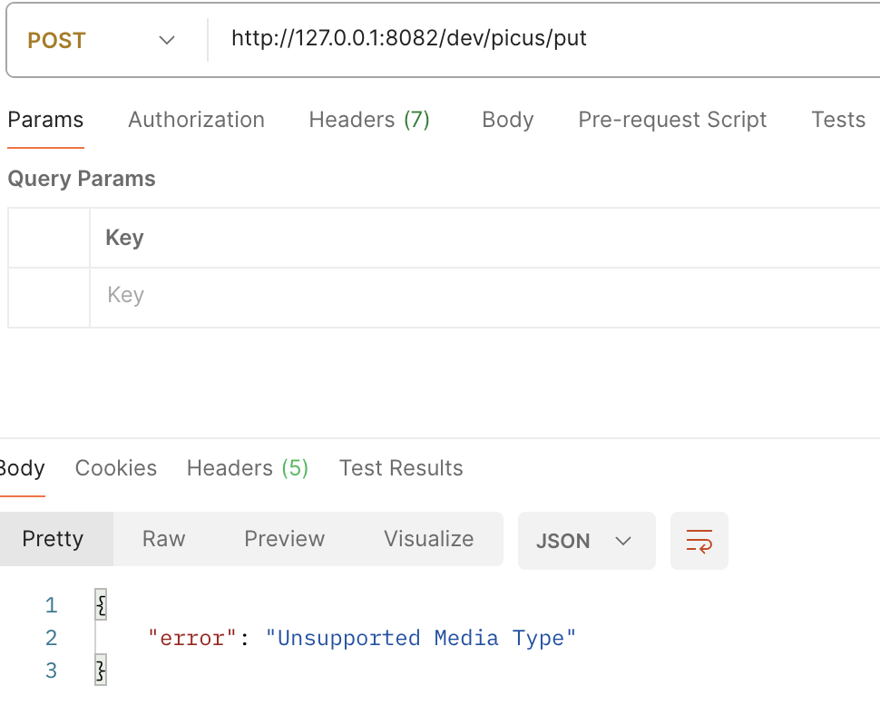

# Picus DevOps Engineer Business Case

## Project Overview

This project involves building and deploying a scalable web application using AWS services, containerization with Docker, and continuous integration/continuous deployment (CI/CD) automation with GitHub Actions. The application is designed to interact with a DynamoDB table via several HTTP endpoints to perform CRUD (Create, Read, Update, Delete) operations. The deployment of the application to AWS ECS is managed through Terraform, ensuring a consistent and repeatable infrastructure setup.

### Technologies Used
- **AWS**: DynamoDB, Lambda, ECS, IAM
- **Terraform**: Infrastructure as Code (IaC) for managing AWS resources
- **Docker**: Containerization of the application
- **GitHub Actions**: CI/CD Pipeline automation
- **Serverless Framework**: For deploying the Lambda function
- **Programming Language**: Python

## AWS Account Setup

To get started, you need to set up an AWS account if you don't already have one:

1. **Sign Up**:
   - Visit the [AWS sign-up page](https://aws.amazon.com/) to create a new account.
   - Follow the on-screen instructions to complete the registration process.

2. **Log In**:
   - After registration, log in to the [AWS Management Console](https://aws.amazon.com/console/) using your credentials.

### AWS Services Required
- **DynamoDB**: A NoSQL database service used to store and retrieve data.
- **Lambda**: A serverless compute service used to run the application's functions.
- **ECS (Elastic Container Service)**: A fully managed container orchestration service used for deploying the Dockerized application.
- **IAM (Identity and Access Management)**: Used to manage access permissions and roles for AWS services.

## DynamoDB Table

The application requires a DynamoDB table for storing and managing data.

### Steps to Create a DynamoDB Table
1. **Navigate to DynamoDB**:
   - From the AWS Management Console, search for DynamoDB and select it.
   
2. **Create a Table**:
   - Click on **Create Table**.
   - Enter a **Table Name** (e.g., `TestDB`).
   - Define the **Primary Key** (e.g., `id` as a number type).
   
3. **Capacity Mode**:
   - Choose between **Provisioned** or **On-demand** capacity modes depending on the expected workload.

4. **Finalize**:
   - Click on **Create** to create the table.

### Table Schema
- **Primary Key**: `id` (number)
- **Attributes**: Additional attributes can be added to store more information in each item.


## Application Endpoints

The web application provides several HTTP endpoints to interact with the DynamoDB table:

### 1. GET /picus/list
- **Functionality**: Retrieves all items stored in the DynamoDB table.
- **Implementation**: This endpoint queries the DynamoDB table and returns a JSON array of all items.
- **Sample Request**:
  ```bash
  curl -X GET http://127.0.0.1:80827dev/picus/list
  ```
- **Sample Response**:
  ```json
  [
    {"id": "1"},
    {"id": "2"}
  ]
  ```
  

### 2. POST /picus/put
- **Functionality**: Saves a JSON object to the DynamoDB table and returns the generated `id`.
- **Implementation**: Accepts a JSON payload, generates a unique `id`, and stores the data in the DynamoDB table.
- **Sample Request**:
  ```bash
  curl -X POST http://127.0.0.1:80827dev/picus/put -d '{"Data": "Sample Data"}'
  ```
- **Sample Response**:
  ```json
  {"id": "1"}
  ```
  

### 3. GET /picus/get/{key}
- **Functionality**: Retrieves a specific item from the DynamoDB table using the provided `id`.
- **Implementation**: Fetches the item corresponding to the `id` from the DynamoDB table and returns it in JSON format.
- **Sample Request**:
  ```bash
  curl -X GET http://127.0.0.1:80827dev/picus/get/1
  ```
- **Sample Response**:
  ```json
  {"id": "1", "item": "Sample Data"}
  ```
  

## Lambda Function: DELETE /picus/{key}

This Lambda function is responsible for deleting an item from the DynamoDB table.

### Implementation Details
- **Serverless Framework**: Used for deploying the Lambda function to AWS.
- **IAM Role/Policy**: The Lambda function must be granted permissions to perform `DeleteItem` operations on the DynamoDB table.

### Steps to Deploy
1. **Create a `serverless.yml` file**:
   - Define the Lambda function, specify the DynamoDB table it interacts with, and configure the necessary IAM roles.
   
   
2. **Deploy using Serverless Framework**:
   - Run the following command to deploy the function:
     ```bash
     sls deploy
     ```

### Sample Request
```bash
curl -X DELETE http://your-api-endpoint/picus/1
```

### Sample Response
```json
{"message": "Item deleted successfully"}
```


## Docker Setup

Docker is used to containerize the application, making it easy to deploy and run in different environments.

### Dockerfile Details
- The `Dockerfile` contains instructions to build a Docker image for the application.
- It defines the base image, copies the application files, installs dependencies, and sets up the application to run.

### Example Dockerfile
```Dockerfile
# Use an official Python runtime as a parent image
FROM python:3.9.6

# Set the working directory in the container
WORKDIR /app

# Copy only requirements.txt to leverage Docker cache
COPY requirements.txt .

# Install dependencies
RUN pip install --no-cache-dir -r requirements.txt

# Copy the rest of the application code
COPY . .

# Expose the port your application runs on
EXPOSE 5000

# Command to run your application
CMD ["python", "ApiHandler.py"]
```

### Building the Docker Image
- To build the Docker image, run the following command in the terminal:
  ```bash
  docker build -t picus-app .
  ```

## CI/CD Pipeline with GitHub Actions

The CI/CD pipeline is set up using GitHub Actions to automate the build, test, and deployment processes.

### GitHub Actions Workflow Configuration
- A GitHub Actions workflow file (`main.yml`) is created in the `.github/workflows` directory of the repository.
- This workflow file contains steps to check out the code, set up the environment, run tests, and deploy the application.

### Example Workflow File
```yaml
name: Build, Test, and Deploy to ECS and Lambda

on:
  push:
    branches: [ main ]

jobs:
  build:
    runs-on: ubuntu-latest

    steps:
    - name: Checkout code
      uses: actions/checkout@v2

    - name: Set up Docker Buildx
      uses: docker/setup-buildx-action@v1

    - name: Log in to Amazon ECR
      env:
        AWS_REGION: ${{ secrets.AWS_REGION }}
        AWS_ACCOUNT_ID: ${{ secrets.AWS_ACCOUNT_ID }}
        AWS_ACCESS_KEY_ID: ${{ secrets.AWS_ACCESS_KEY_ID }}
        AWS_SECRET_ACCESS_KEY: ${{ secrets.AWS_SECRET_ACCESS_KEY }}
      run: |
        aws configure set aws_access_key_id $AWS_ACCESS_KEY_ID
        aws configure set aws_secret_access_key $AWS_SECRET_ACCESS_KEY
        aws configure set region $AWS_REGION
        aws ecr get-login-password --region $AWS_REGION | docker login --username AWS --password-stdin $AWS_ACCOUNT_ID.dkr.ecr.$AWS_REGION.amazonaws.com

    - name: Create ECR repository if it doesn't exist
      env:
        AWS_REGION: ${{ secrets.AWS_REGION }}
        AWS_ACCOUNT_ID: ${{ secrets.AWS_ACCOUNT_ID }}
        AWS_ACCESS_KEY_ID: ${{ secrets.AWS_ACCESS_KEY_ID }}
        AWS_SECRET_ACCESS_KEY: ${{ secrets.AWS_SECRET_ACCESS_KEY }}
      run: |
        aws ecr describe-repositories --repository-names picus-app --region $AWS_REGION || \
        aws ecr create-repository --repository-name picus-app --region $AWS_REGION

    - name: Build, tag, and push Docker image
      env:
        AWS_REGION: ${{ secrets.AWS_REGION }}
        AWS_ACCOUNT_ID: ${{ secrets.AWS_ACCOUNT_ID }}
        AWS_ACCESS_KEY_ID: ${{ secrets.AWS_ACCESS_KEY_ID }}
        AWS_SECRET_ACCESS_KEY: ${{ secrets.AWS_SECRET_ACCESS_KEY }}
        ECR_REGISTRY: ${{ secrets.AWS_ACCOUNT_ID }}.dkr.ecr.${{ secrets.AWS_REGION }}.amazonaws.com
        ECR_REPOSITORY: picus-app
        IMAGE_TAG: latest
      run: |
        docker build -t $ECR_REGISTRY/$ECR_REPOSITORY:$IMAGE_TAG .
        docker push $ECR_REGISTRY/$ECR_REPOSITORY:$IMAGE_TAG

  test:
    runs-on: ubuntu-latest
    needs: build
    steps:
    - name: Checkout code
      uses: actions/checkout@v2

    - name: Set up Python
      uses: actions/setup-python@v2
      with:
        python-version: '3.9'

    - name: Install dependencies
      run: |
        python -m pip install --upgrade pip
        pip install -r requirements.txt

    - name: Run tests
      run: |
        pip install pytest pytest-cov
        pytest test_example.py --doctest-modules --junitxml=junit/test-results.xml --cov=com --cov-report=xml --cov-report=html

  deploy:
    runs-on: ubuntu-latest
    needs: [build, test]
    env:
      AWS_REGION: us-west-2 

    steps:
      - name: Checkout code
        uses: actions/checkout@v2

      - name: Set up AWS CLI
        uses: aws-actions/configure-aws-credentials@v1
        with:
          aws-access-key-id: ${{ secrets.AWS_ACCESS_KEY_ID }}
          aws-secret-access-key: ${{ secrets.AWS_SECRET_ACCESS_KEY }}
          aws-region: ${{ secrets.AWS_REGION }}

      - name: Register ECS task definition
        run: |
          export TASK_DEFINITION=$(cat << EOF
          {
            "family": "picus-task",
            "taskRoleArn": "arn:aws:iam::${{ secrets.AWS_ACCOUNT_ID }}:role/ecsTaskExecutionRole",
            "executionRoleArn": "arn:aws:iam::${{ secrets.AWS_ACCOUNT_ID }}:role/ecsTaskExecutionRole",
            "networkMode": "host",
            "containerDefinitions": [
                {
                    "name": "picus-container",
                    "image": "${{ secrets.AWS_ACCOUNT_ID }}.dkr.ecr.${{ secrets.AWS_REGION }}.amazonaws.com/picus-app:latest",
                    "cpu": 256,
                    "memory": 512,
                    "portMappings": [
                        {
                            "name": "picus-container-5000-tcp",
                            "containerPort": 5000,
                            "hostPort": 5000,
                            "protocol": "tcp"
                        }
                    ],
                    "essential": true,
                    "environment": [],
                    "mountPoints": [],
                    "volumesFrom": [],
                    "systemControls": []
                }
            ],
            "requiresCompatibilities": [
                "EC2"
            ],
            "cpu": "256",
            "memory": "512",
            "runtimePlatform": {
                "cpuArchitecture": "X86_64",
                "operatingSystemFamily": "LINUX"
            }
          }
          EOF
          )
          
          aws ecs register-task-definition --cli-input-json "$TASK_DEFINITION" --region $AWS_REGION

      - name: Create ECS service if it doesn't exist
        run: |
          aws ecs describe-services --cluster picus --services picus1 --region $AWS_REGION || \
          aws ecs create-service --cluster picus --service-name picus1 --task-definition picus-task --desired-count 1 --region $AWS_REGION

      - name: Deploy to ECS
        run: |
          aws ecs update-service --cluster picus --service picus1 --force-new-deployment --region $AWS_REGION

      - name: Deploy Lambda function
        run: |
          cd terraform-picus-service
          terraform init
          terraform apply -auto-approve
```


## Deployment to AWS ECS Using Terraform

The application is deployed to AWS ECS using Terraform, ensuring consistent and reproducible infrastructure management.

### Steps to Deploy the Application

1. **Install Terraform**:
   - Make sure Terraform is installed on your system. Follow the [Terraform Installation Guide](https://learn.hashicorp.com/tutorials/terraform/install-cli) if needed.

2. **Create Terraform Configuration Files**:
   - Write Terraform configuration files (`.tf` files) to define the ECS cluster, task definition, and service. 
   - Include IAM roles and policies required for the ECS tasks and services.

3. **Initialize Terraform**:
   - In the directory containing your Terraform configuration files, run:
     ```bash
     terraform init
     ```

4. **Deploy the Infrastructure**:
   - To deploy the AWS resources defined in the Terraform configuration, run:
     ```bash
     terraform apply
     ```
   - Review the plan and confirm to proceed with the deployment.

### Zero Downtime Deployment
- The ECS service is configured to ensure zero downtime during deployments by setting the **minimum healthy percent** to greater than 0 and **maximum percent** to less than 100.
- This configuration allows new tasks to start and stabilize before the old ones are terminated.

### Example ECS Configuration in Terraform
- **Cluster Name**: `picus`
- **Service Name**: `picus1`
- **Task Definition**: `picus-task`

## Security Considerations

- **IAM Roles**: Use the principle of least privilege when creating IAM roles and policies to ensure that services and users only have the permissions they need.

- **Environment Variables**: Store sensitive information such as database credentials securely using AWS Secrets Manager or Parameter Store.


## Testing

Testing is a critical part of the DevOps pipeline, ensuring that the application

 functions as expected before and after deployment.

### Local Testing
- You can test the application locally by running it in a Docker container and using tools like `curl` or Postman to interact with the endpoints.

### CI/CD Pipeline Testing
- The GitHub Actions workflow includes steps to run unit tests before the application is deployed to production.

### Example Test Command
```bash
pytest tests/
```

## Troubleshooting

### Common Issues
- **IAM Permissions**: Ensure all IAM roles and policies are correctly configured to avoid permission-related errors.
- **Docker Build Failures**: Check the `Dockerfile` for any syntax errors or missing dependencies.
- **Lambda Deployment Errors**: Validate the `serverless.yml` file for any syntax errors and ensure that the necessary AWS CLI configurations are correct.

### AWS Documentation Links
- [DynamoDB Documentation](https://docs.aws.amazon.com/dynamodb/)
- [Lambda Documentation](https://docs.aws.amazon.com/lambda/)
- [ECS Documentation](https://docs.aws.amazon.com/ecs/)
- [IAM Documentation](https://docs.aws.amazon.com/iam/)
- [Terraform Documentation](https://www.terraform.io/docs)

## Conclusion

This project showcases a comprehensive DevOps workflow, from building and deploying a scalable application using AWS services to automating the entire process with CI/CD pipelines. The use of Terraform for infrastructure management ensures a consistent, repeatable, and scalable deployment process. The application is designed to be robust, secure, and highly available, making it an excellent demonstration of modern DevOps practices.

## References
- [DynamoDB Documentation](https://docs.aws.amazon.com/dynamodb/)
- [Lambda Documentation](https://docs.aws.amazon.com/lambda/)
- [ECS Documentation](https://docs.aws.amazon.com/ecs/)
- [IAM Documentation](https://docs.aws.amazon.com/iam/)
- [Terraform Documentation](https://www.terraform.io/docs)
- [Docker Documentation](https://docs.docker.com/)
- [GitHub Actions Documentation](https://docs.github.com/en/actions)

